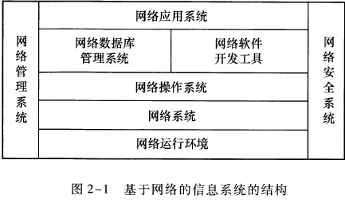
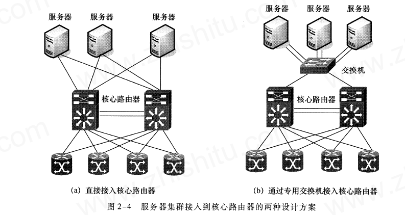

# 中小型网络系统总体规划与设计
## 常考知识点(选择题形式)
* 网络总体设计的基本方法
* * 核心层两个方案设计的比较
* * 汇聚层和接入层上下联带宽之比
* 网络关键设备选型
* * 路由器的关键技术指标
* 服务器设备选型
* * 服务器采用的主要技术
* * 服务器的性能（系统高可用性）

## 2.1 基础知识
### 2.1.1 基千网络的信息系统基本结构
* 
* 网络运行环境主要包括机房与电源两个部分
* 网络系统：支持信息系统的网络包括网络传输基础设施、网络设备(网络设备包括路由器、交换机、网关、网桥、集线器、中继器、收发器、网卡、Modem 和远程通信
服务器等。)两部分。
* 目前主流的网络操作系统主要有： Windows NT Server 和Windows 2000 Server 操作系统、NetWare 操作系统、UNIX 操作系统与Linux 操作系统等。
* 网络应用软件开发与运行环境包括：网络数据库管理系统与网络软件开发工具。
* 1. 网络数据库管理系统
* 2. 网络软件开发工具(标准开发工具主要包括Java 、Visual C+ ＋、Visual Basic 、Delphi 等。)
* 网络管理与网络安全系统

## 2.2 实训环节
### 2.2.1 网络用户调查与网络工程需求分析
* ```网络需求详细分析主要包括:```
```
    网络总体需求分析
    综合布线需求分析
    网络可用性与可靠性分析
    网络安全性需求分析
    分析网络工程造价估算
```
### 2.2.2 网络总体设计基本方法
* 设计网络建设总体目标
* 确定网络系统方案设计原则
* 网络系统总体设计（`分层设计`）
* 设计网络拓扑结构
* 进行网络设备选型
* 网络系统安全设计
#### `核心层网络结构设计`
* 

| 名称 | 优点 | 缺点 |
| --- | --- | --- |
| a图，采取`链路冗余`直接连接两台核心路由器  | `直接利用核心路由器的带宽`  | 占用核心路由器端口较多，高端路由器的端口价格高，`设备成本上升`  |
| b图，采取`专用服务器交换机`，同时采用`链路冗余`间接连接核心路由器  | `可以分担核心路由器的带宽`  | `会形成带宽瓶颈，存在单点故障的危险`  |
#### 汇聚层网络与接入层网络结构设计
* `层次之间的上联带宽与下联一级带宽之比为 1:20`
### 2.2.3 网络关键设备的选型
#### 路由器选型的依据
* 分类：高端，中端，低端
* `路由器性能主要指路由器背板交换能力(数据传输能力)，背板交换能力大于4Gbit/s的称作高端路由器；低于4Gbit/s的称为中低端路由器`
#### `路由器关键技术指标`
|  |  |
| -- | -- |
| `吞吐量` | 指的是`其包转发能力`，`与端口数量和速率，包类型，包长度关系密切`，分为端口吞吐量、整机吞吐量；  |
| `背板能力` | 指的是`路由器输入端与输出端之间的物理通道`，`他决定了路由器的吞吐量`。`高性能路由器`一般采用`交换式结构`，`传统的路由器`采用的是`共享背板结构` |
| `延时` | `路由器对数据包进行处理和转发所需的时间`,延时与包长度，链路传输速率有关 |
| `延时抖动` | 延时的变化量，`由于数据包对延时抖动要求不高，所以一般不把延时抖动作为高速路由器的指标，但是语音视频业务对延时抖动要求较高` |
| `丢包率` | 是指在持续稳定的负荷下，由于包转发能力的限制而造成的包丢失的概率。`常作为路由器超负荷工作时的性能衡量指标` |
| `突发处理能力` | `突发处理能力是以最小帧间隔发送数据包而不引起丢失的最大发送速率来衡量的。`(想象一下，你有一个网络设备（比如路由器），而你需要通过它传输很多数据包。这些数据包需要以很短的时间间隔连续发送给路由器。突发处理能力就是指这个路由器在一段时间内能够处理和转发这些连续发送的数据包，而不会丢失或丢弃它们。`ChatGpt`) |
| `服务质量` | `主要表现在队列管理机制、端口硬件队列管理和支持QoS 协议上。` |
| `路由表容量` | 是`路由器用来决定包转发路径的主要依据。` |
| `网管能力` | `网络管理员可以通过网络管理程序和通用的网络管理协议SNMPv2 等` | 
#### `高端路由器的可靠性和可用性指标应该达到一下几点`
* 无故障连续工作时间`大于10万小时`，系统故障时间恢复时间`小于30min`
* `系统具有自动保护切换功能，主备用切换时间小于50 毫秒；`
* `SDH(同步数字体系)与ATM(异步传输模式) 接口自动保护切换功能，切换时间小于50 毫秒；`
#### 交换机的主要技术指标
* 交换机用于连接(局域网内)多个计算机或其他网络设备，以便它们可以相互通信和交换数据。
* 主要的技术指标：背板带宽，`全双工端口总带宽`，交换方式，支持VLAN能力。
* `全双工（Full-Duplex）是指数据传输可以同时进行双向的方式，允许同时进行发送和接收操作`。在全双工通信中，设备可以同时发送和接收数据，而不需要进行时分复用或频分复用。
* `全双工端口总带宽计算方法： 端口数x端口速率x2`
#### 交换机的配置选择
* 拓展槽数、机架插槽数、最大可堆叠数、最大/最小GE端口数、端口密度与端口类型、缓冲区大小、支持的网络协议类型、MAC地址表大小、设备冗余、可管理性。
#### 交换机与路由器的区别

| 交换机 | 路由器 |
| ------ | ------ |
| 在局域网中传输数据包 | 在广域网中传输数据包 |
| 使用 MAC 地址识别设备 | 使用 IP 地址识别设备 |
| 以数据链路层（第二层）操作 | 以网络层（第三层）操作 |
| 通过交换表（MAC 地址表）转发数据 | 通过路由表（IP 地址表）转发数据 |
| 仅支持同一网段内的设备通信 | 支持不同网段之间的设备通信 |
| 无需配置 IP 地址 | 需要配置 IP 地址 |
| 速度较快，适合局域网内部通信 | 速度较慢，适合跨网络通信 |
| 通常用于构建局域网 | 通常用于连接不同局域网或互联网 |

* 以上是交换机和路由器之间的一些主要区别。交换机主要用于局域网内部的数据包转发，使用 MAC 地址进行设备识别和交换表进行数据转发；而路由器则用于不同网络之间的数据包转发，使用 IP 地址进行设备识别和路由表进行数据转发。交换机适合构建局域网，而路由器适合连接不同局域网或互联网。
### 2.2.4 网络服务器选型
* 各种大型、中型计算机和超级服务器都采用`RISC 结构处理器`，`操作系统采用UNIX` 。
* `服务器磁盘性能表现在磁盘存储容量与I/O速度。`
#### 服务器采用的相关技术
|||
|-|-|
|`热拔插技术`|`可以实现用户在不断电情况下进行故障硬盘、板卡等部件的更换`|
|`集集群(Cluster) 技术群`|`大大提高了系统的数据处理能力`，如果其中一台主机出现故障，它所运行的程序将立即转移到其他主机，`因此集群计算技术可以大大提高服务器的可靠性、可用性与容灾能力,不影响正常使用。`|
|`存储能力`|`是衡量服务器性能与选型的重要指标之一。评价高性能存储技术的指标主要是存取1/0 速度和磁盘容量。在提高磁盘容景的基础上，通过改善并行读写能力，提高硬盘的存取速度和吞吐量。通过磁盘容错处理，提高系统的可靠性。`|
|`对称多处理(SMP)技术`|`可以实现多CPU结构的服务器中均衡负载`|
|`非一致内存访问(NUMA)技术`|`非一致内存访问(NUMA) 技术是将对称多处理(SMP) 技术与集群(Cluster) 技术结合起来，用于多达64 个或更多CPU 的服务器之中，以获得更高的性能价格比。`|
#### 服务器性能-系统高可用性
*  `系统高可用性=平均故障时间/(平均故障时间+平均处理时间)`

|系统高可用性|不超过的时长|
|-|-|
|`99.9%`|`8.8h`|
|`99.99%`|`53min`|
|`99.999%`|`5min`|
### 2.2.5 网络系统安全设计基本方法
* ...


