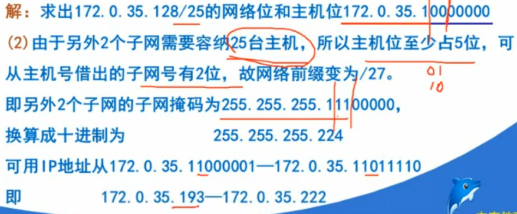

# IP地址规划设计技术(核心内容)
* 考试中会出现在选择题8、9、10、11以及综合题第1大题，应用题第3答题
## 3.1 基础环节
### `标准分类`的IP地址
* 有两个固定长度的字段组成
* 网络号 net-id: 标志主机(或路由器)所连接的网络。
* 主机号 host-id: 标志该主机(或路由器)
* 
#### IP地址表示方法-点分十进制
#### 标准分类IP地址的使用范围
* 
* ```
    注意: 
        A类中 -2是指 全0的地址（0.0.0.0）被保留作为默认路由（默认网关），
        而网络号为全1的地址（127.0.0.0）则被保留为环回地址（用于本地主机测试）

        B类中 -1是指 128.0.0.0是保留地址，不分配网络。
        C类中 -1是指 192.0.0.0是保留地址，不分配网络。

* `整个127.0.0.0/8范围内的所有地址都被视为回环地址，其中最常见的是127.0.0.1。127.0.0.0为网络号`
### 划分子网的三级地址结构
* 标准分类的IP 地址在使用过程中，显现出的第一个就是地址有效利用率问题。提出`子网(subnet)`
* `子网采用了 网络号-子网号-主机号 三层结构`
* `主机号`借用若干位作为 `子网号`
* `子网掩码可以区分出网络位和主机位，可以确定网络地址`
* `IP地址 AND(与运算,全1为1) 子网掩码 = 网络地址`
* `IP地址 AND 子网掩码取反 = 主机地址`
* 
* 十进制转二进制-短除法 11
* ```
    2|11
      ——
     2|5  1
       ——
       2|2  1
         ——
          1  0    
    所以 11(10) --> 1011(2)
#### 不常用的特殊地址
* `直接广播地址，将网络地址的主机位全为1`
* `受限广播地址，255.255.255.255`
## 3.2 实训环节
### 利用子网划分网络地址的方法
#### `划分子网的基本方法`
* 选择的`子网掩码`将会产生`多少个子网`？`2的N次方-2`(N代表网络位借用主机位的位数，-2 全0全1的不要)。
* 每个子网能`有多少主机`？`2的M次方-2`(M代表主机位，-2全0全1的不要)
* 每个子网的`广播地址`: `主机位全为1`。 
#### `真题`
* 
* 
* 
### 构成超网的无分类域间路由(CIDR)技术(IP聚合)
* 一种网络路由优化技术，旨在减少路由表中的条目数量，提高路由表查找和转发的效率。
* 它通过将相邻的IP地址范围合并成更大的IP前缀，从而减少路由表中的条目数量。
* 更加有效地分配IPv4地址空间
* `使用斜线记法(CIDR记法)，在IP地址后面加上一个斜线 '/'`
* CIDR把网络前缀都相同的连续IP地址组成一个`CIDR地址块(路由聚合，构成超网)`。
* 例如：`128.14.32.0/20代表前20位是网络前缀`
* `聚合后的ip(带后缀)不能与主机ip(带后缀)相同`
### NAT技术
* 专用IP地址(私有IP，内网IP)的范围

|地址类别|地址范围|
|-|-|
|A类地址`1`个地址块|10.0.0.0-10.255.255.255|
|B类地址`16`个地址块|172.16.x.x-172.31.x.x|
|C类地址`256`个地址块|192.168.0.x-192.168.255.x|
#### `NAT工作原理`
* 需要NAT路由器(装有NAT软件)，至少有一个有效的外部全球地址IP。
* 所有使用本地地址的主机和外界通信时都要在NAT路由器上将其本地地址换成NAT路由器IP，才能连接Internet。
* 
### IPv6
* IPv6 具有更大的地址空间，`128`个比特位
* `冒号十六进制记法`，共8段，每段4个16进制(16个二进制)。
* `零压缩法：连串的零可用一对冒号所取代`，例如：FF05:0:0:0:0:0:0:B3 --> FF05::B3
* 零压缩发，统一IP地址不能出现两次
* `CIDR的斜线记法任然可用，IP地址/前缀长度`


