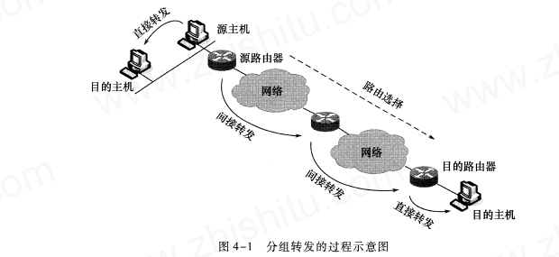
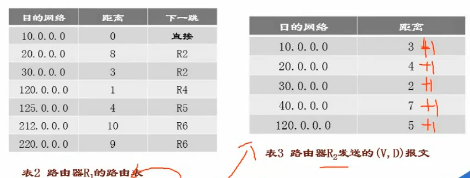
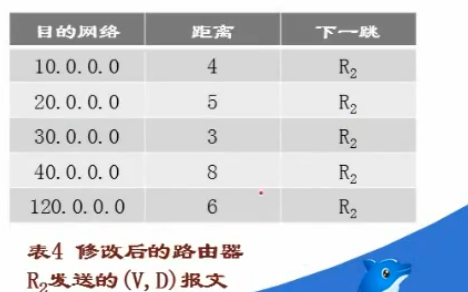
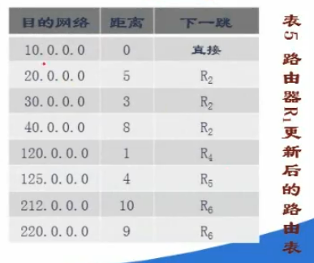

# 路由设计基础(选择题为主)
* 一台主机通常是与一台路由器相连接，这台路由器就是该主机的默认路由器(default router) ，又称为第一跳路由器(first-hop router) 或缺省路由器。
* 发送主机的默认路由器又叫作源路由器。
* 目的路由器是直接与目的主机相连的路由器。
* `分组转发`: 是在互联网中路由器转发IP分组的数据转发机制，可分为直接战法和间接转发两类。
* 
## 路由选择的基本概念
* 跳数是指一个分组从源结点到达目的结点经过的路由器的个数。一般来说，跳数越少的路径越好。
* 带宽指链路的最大传输速率
* 延时是指一个分组从源结点到达目的结点所花费的时间。
* 负载是指单位时间内通过路由器或线路的通信量。
* 可靠性是指传输过程中的误码率。
* 开销一般是指传输过程中的耗费，耗费通常与所使用的链路带宽相关。
* 静态路由器: 由人工建立的路由表，手动修改，开销小，属于小型网络。
* 动态路由表: 由系统自动运行动态路由选择协议而建立的路由表，复杂，开销大，用于大型网络。
## 路由选择的分类
* 自治系统（AS）是互联网中的一个单独的网络域，由一组路由器和网络设备组成，由同一管理机构负责运营和管理。

|内部网关协议|外部网关协议|
|-|-|
|`路由信息协议(RIPv1、RIPv2)，开放最短路径优先(OSPF)`|`边界网管协议(BGP)`|
### `RIP协议`（选择题13必考）
* `要求路由器周期性的向外发送路由表刷新报文`
* `报文由若干个（V，D）组成，其中V代表目的网络，D代表距离也就是还需要经过的多少个路由器（跳数）才能抵达目的网络。`
* `距离向量协议`
* `跳数小于15`
* `适用于小型网络`
#### 路由表的初始化
* 路由器刚启动，路由表初始化，只包含其直接相连的网络，距离为0；
* 
#### 路由表的更新
* R1经过一段时间运行后，路由信息如表2，接收到路由器R2发送的报文如表3（R1与R2直接相连）
* 
* 
* `对修改后的R2路由表(每一项中距离加一)中的每一个条目操作`
* * `如果条目中的目的网络不在路由表中，则把该条目加到R1路由表中。`
* * `若相同，查看下一跳字段给出的路由器地址是否相同，相同则把该条目替换到R1路由表中。`(**下一跳都相同，都是到统一目的网络，R2(最新状态)的距离会比R1的准确。**)
* * `下一跳不相同，则替换成距离最短的条目。`
* `更新后的R1路由表`
* 
#### `真题`
* 
### OSPF(开放最短路径优先)协议(选择题14)
* `适用于大型网络`

|`OSPF协议`|RIP协议|
|-|-|
|`分布式链路 协议`|距离向量协议|
|`发送的信息是于本路由器相邻的所有路由器的链路状态`|交换的信息是当前本路由器所知道的全部信息|
|`用洪泛法向所有路由器发送此信息`|仅和相邻路由器交换信息|
|`所有路由器多有一个唯一的链路状态数据库用来存储本区域的拓扑结构图`|每一个路由虽然知道所有的网络的距离和下一跳路由器，但不知道全网的拓扑图|
* `为了适应大规模的网络，并使更新过程收敛得更快， OSPF 协议将一个自治系统再划分为若干个更小的范围，叫作区域(area) 。`
* `每一个区域有一个32 位的区域标识符（用点分十进制表示），在一个区域内的路由器数不超过200 个。`
* `OSPF 协议使用层次结构的区域划分`
### 外部网关协议-BGP(边界网关协议)
* `路由向量协议`
* `无法找到一条最佳路由`
* 每个资质系统至少有一个路由器作为该系统的`BGP发言人`。
* 不同的`BGP发言人在交换信息之前`，需要建立`TCP连接`。