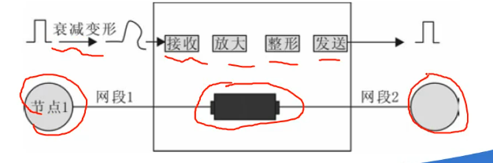

# 局域网技术
## 考试说明
* 选择题15-16题
* 总和不限基础的标准
* 局域网互联设备 (集线器)
* 以太网物理层的命名规则
* 综合布线系统传输介质的特点
* 综合布线系统子系统的设计
## 5.1 基础环节
### 5.1.1 局域网组网基础知识
#### 局域网标准
* 目前使用的标准主要有802.1、802.3、`802.11(wifi)`、`802.16(WiMAX)`
* 
#### 交换式局域网
* 
#### 虚拟局域网技术(VLAN)
* 
#### VLAN优点
* `广播域被限于一个VLAN，节省带宽，提高网络处理能力能力; `
* `VLAN之间不直接通信，即一个VLAN内的用户不能与同一VLAN内的用户直接通。其他VLAN，但需要通过路由器或三层交换机等设备，增强局域网的安全性`
* `VLAN可用于将不同的用户划分到不同的工作组，同一工作组的用户不必局限于固定的物理范围。这使得网络建设和维护更加方便、灵活。`
### 5.1.2 综合布线基本概念
* 综合布线系统(PDS)
#### 综合布线系统标准
* 北美标准`ANSI/TIA/EIA-`***568***`-A`
* TIA/EIA-568-B.1,TIA/EIA-568-B.2和TIA/EIA-568-B.3标准
* 国际标准`ISO/IEC `**11801**
* 国内标准 GB/T 50311-2000和GB/T 50312--2000
## 5.2 实训环节
### 5.2.1 局域网互联设备
#### 中继器(物理层)
* `主要完成物理层的功能,完成信号复制、调整和放大功能。`
* 
#### 中继器的特点
* 中继器的工作不涉及帧的结构，不对帧的内容做任何处理。中继器只能起到增加传输介质长度作用。
* `共享一个冲突域,只能一个节点发送数据，但能同时接收`
* ```
    冲突域是指会产生冲突的最小范围，也就是说，
    如果有两个或更多的数据报文想从这里通过时就会出现冲突了。

    举个例子，如果你家里有两个人同时想用同一个电话打电话，
    那么就会出现冲突。这时候你们可以约定好一个人先打完再让另一个人打，
    这样就不会出现冲突了。计算机网络中也是一样的道理，
    只不过是通过一些协议来解决这个问题的。
#### 集线器(物理层)
* 是`局域网`中使用的`连接设备`，可以链接多个计算机
* `是基于`**广播**`完成数据转发的；`
* `在星型结构中其中一个节点的线路发生故障是不会影响其他节点。`
#### 集线器的特点
* 连接一个集线器的所有节点`共享一个冲突域`，只能一个节点发送数据，但能同时接收。
* 
### 5.2.2 以太网组网
#### 以太网
* `命名规则: 802.3 x Type-y-Name,`
* ```
    x表示传输速率(Mbit/s)，
    y表示网段的最大长度(100m),
    type表示传输方式是基带还是频带，
    Name表示局域网的名称
#### 10Base-T标准以太网
* 使用`集线器`，则`其连接的节点仍在一个冲突域(同一时间只能一个节点发送数据帧，其他只能接收)`。
#### 快速以太网组网
* `半双工模式`: 传输数据时不能在发送时接收，接收时发送。
* `全双工模式`: 可以在发送时接收，接收时发送，支持`全双工的快速以太网拓扑结构是星型的`。
### 5.2.3 综合布线网络(PDS)结构设计
#### PDS的网络结构
* `组合配置 包含组合逻辑和配置形式。`
* `组合逻辑描述网络功能的体系结构；`
* `配置形式 描述网络单元的邻接关系`。
#### 主要部件
* 连接设备和`传输介质`
* 常用介质: `双绞线(非屏蔽双绞线UTP;屏蔽双绞线STP FTP SFTP)`、光缆(纤)。

|传输介质|特点|
|-|-|
|UTP|轻量级、体积小、弹性好。`成本低，但是抗电磁干扰的性能差，会向外辐射，安全性差`|
|`STP,FTP,SFTP`|`成本高，体积大，不宜施工；但具有防止外来电磁干扰和防止向外辐射的特性。`|
### 综合布线系统子系统设计
#### 建筑子系统设计
* 建筑群布线子系统可以是`架空布线`、`巷道布线`、`直埋布线`、`地下管道布线`，或者是这四种敷设方式的`任意组合`。

|布线方式|特点|
|-|-|
|`地下管道布线`|`由于管道是由耐腐蚀材料做成的，所以这种方法对电缆提供了最好的机械保护，使电缆受损维的机会减到最低程度,可保持建筑物的外貌。`|
|`直埋布线`|`可保持建筑物的外貌。`|
|`架空布线`|`电缆可采用自支撑电缆，也可把户外电缆系在钢丝绳上。`|
|`巷道布线`|`可充分利用原有安全设施(原有供暖热水管)，且造价低。`|
#### 设备间子系统
* `是综合布线系统的关键部分`,需考虑的因素多。
#### 管理子系统
#### 干线子系统
* 连接方式

|连接方式|特点|
|-|-|
|`点对点结合`|`最简单，最直接的线缆连接方法`。|
|`分支结合`|`采用一根通信容量较大的主馈电缆`。|
#### 水平子系统设计
* `一般电缆长度不超过90m`。
#### 工作区子系统设计
* `其中，嵌入式安装插座是用来连接双绞线的，多介质信息插座用来连接铜缆和光纤，用以解决用户对“光纤到桌面”的需求。`
* `适配器具有转换不同数据速率的功能`。


