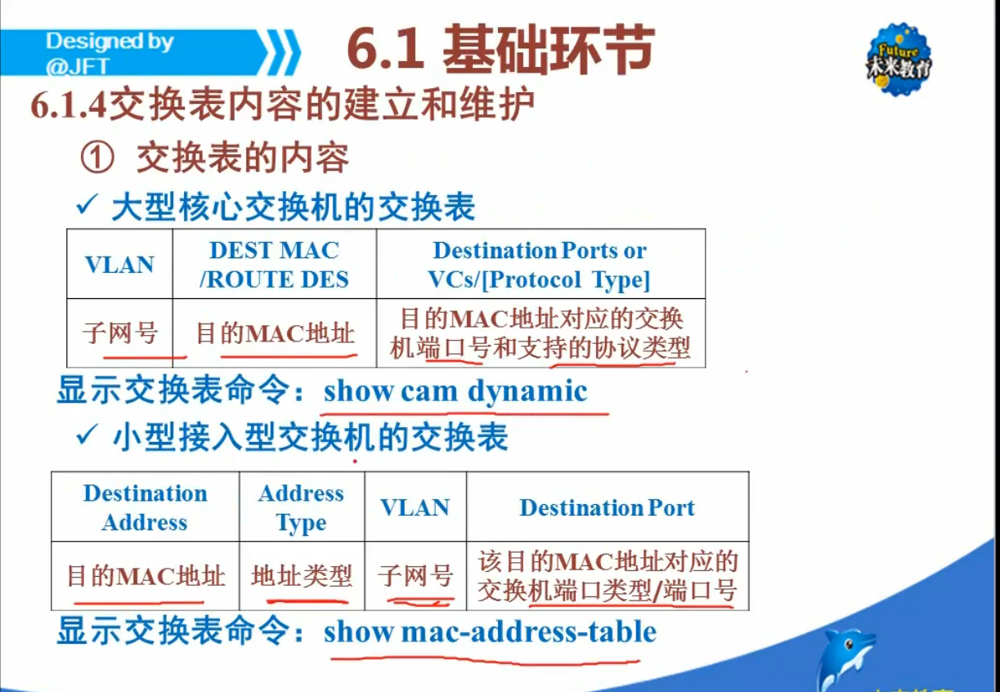
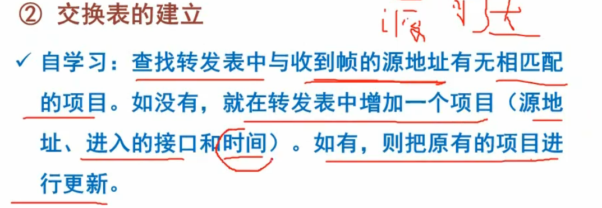
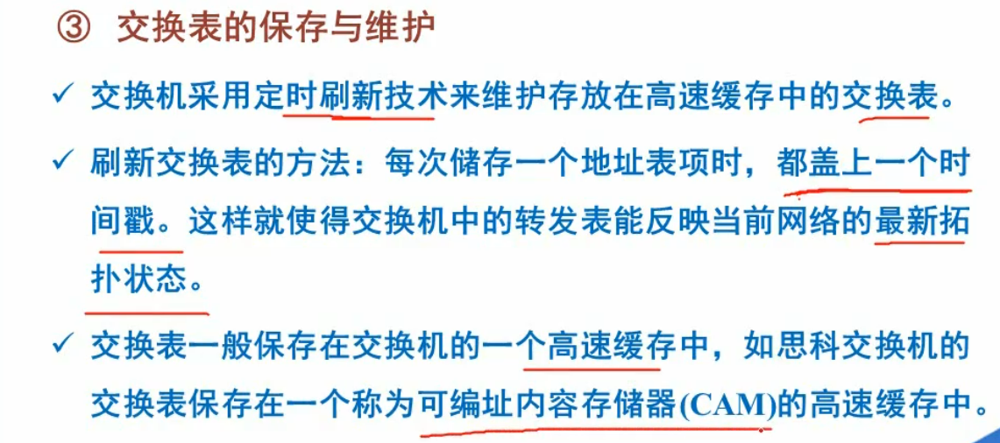
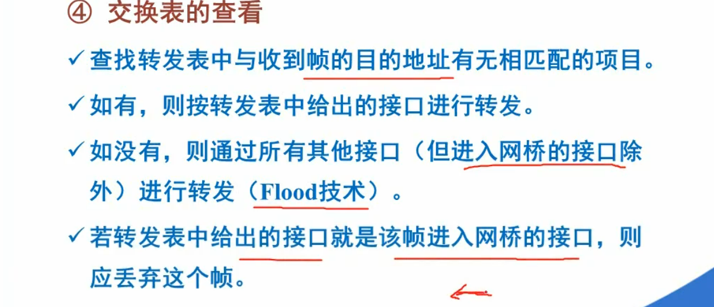
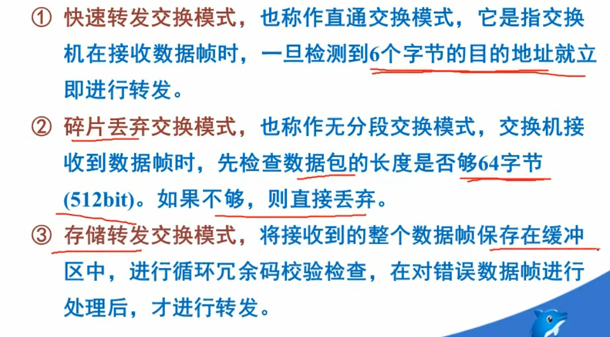

# 交换机及其配置
## 考点说明
1. 考察交换机基础知识以及交换机的配置方法。
2. 交换机端口配置、虚拟局域网VLAN技术、生成树协议STP。

## 6.1基础环节
### 6.1.1局域网交换机基本概念和功能
* 定义: 交换机工作在数据链路层，根据进入端口的mac帧的目的地址，对收到的帧进行转发，过滤。
* 基本功能: `建立和维护交换表`，`在源/目的端口间建立虚连接`，`完成数据帧的转发或过滤`。
* 交换表: 保存设备目的Mac地址与端口设备对应关系的表。
### 6.1.2 局域网交换机工作原理
### 6.1.4 交换表的内容的建立和维护
* 
* 
* 
* 
### 6.1.6 交换机的交换模式
* 